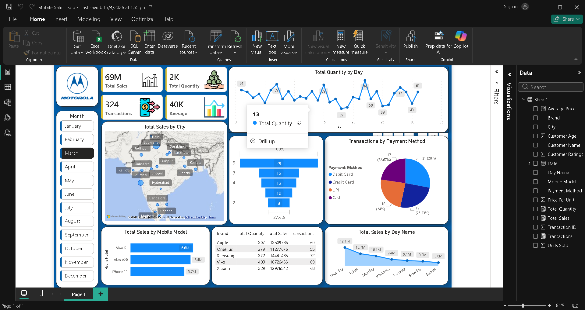
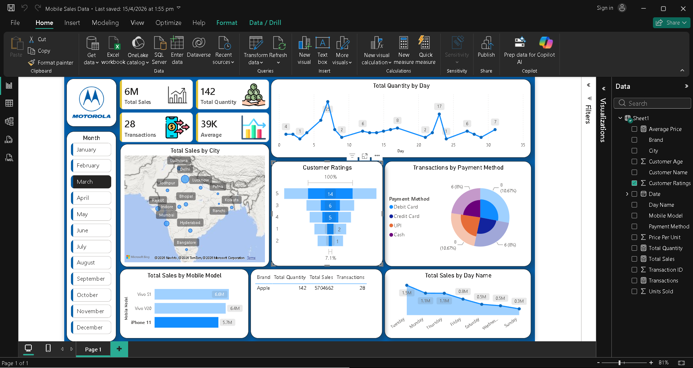

# 📱 Mobile Sales Data Dashboard | Power BI

An interactive **Power BI dashboard** designed to analyze mobile phone sales performance across different brands, cities, payment methods, and time periods. The dashboard provides key business insights through dynamic visualizations, KPIs, and filters, enabling data-driven decision-making.

---

## 📊 Dashboard Preview

### Overall Dashboard
> Add your first screenshot here



### Filtered Dashboard View
> Add your second screenshot here



---

## 📌 Project Overview

This project focuses on analyzing mobile sales data using Power BI. The dashboard enables users to monitor sales performance, identify top-performing brands and cities, analyze customer purchasing trends, and explore transaction patterns using interactive filters.

---

## 🎯 Business Objectives

- Monitor overall sales performance
- Identify high-performing mobile brands
- Analyze sales distribution across cities
- Track daily sales trends
- Understand customer payment preferences
- Evaluate customer ratings
- Enable month-wise sales comparison through interactive filtering

---

## 📈 Key Performance Indicators (KPIs)

- 💰 Total Sales
- 📦 Total Quantity Sold
- 🛒 Total Transactions
- 💵 Average Sales

---

## 📊 Dashboard Features

### Sales Analysis
- Total Sales by Mobile Model
- Total Sales by City (Map Visualization)
- Total Sales by Day Name
- Total Quantity by Day

### Customer Analysis
- Customer Ratings Distribution
- Brand-wise Sales Summary

### Transaction Analysis
- Payment Method Distribution
- Total Transactions

### Interactive Features
- Month Slicer
- Cross Filtering
- Drill Down
- Dynamic KPI Cards

---

## 🛠️ Tools & Technologies

- Power BI Desktop
- Power Query
- DAX (Data Analysis Expressions)
- Microsoft Excel
- Data Modeling
- Data Visualization

---

## 📂 Dataset

The dataset contains mobile sales transaction records including:

- Mobile Brand
- Mobile Model
- City
- Date
- Quantity Sold
- Total Sales
- Payment Method
- Customer Ratings
- Transactions
- Average Price

---

## 📌 Insights Generated

- Identified top-selling mobile models.
- Compared sales performance across multiple cities.
- Analyzed daily sales trends.
- Evaluated preferred payment methods.
- Tracked customer ratings and satisfaction.
- Monitored monthly sales performance using interactive filters.

---

## 📁 Repository Structure

```
Mobile-Sales-Dashboard/
│
├── Mobile Sales Data.pbix
├── Dashboard-Screenshot.png
├── Dashboard-Screenshot2.png
├── README.md
└── Dataset.xlsx (Optional)
```

---

## 🚀 How to Use

1. Download the repository.
2. Open **Mobile Sales Data.pbix** using Power BI Desktop.
3. Refresh the data (if required).
4. Explore the dashboard using the Month slicer and interactive visuals.

---

## 📷 Dashboard Highlights

✔ Interactive KPI Cards

✔ Geographic Sales Analysis

✔ Brand-wise Performance

✔ Payment Method Analysis

✔ Customer Ratings Analysis

✔ Monthly Filtering

✔ Cross-Filtering Across Visuals

---

## 👨‍💻 Author

**Pankaj Singh Ladwal**

**Aspiring Data Analyst**

### Skills
- Power BI
- SQL (MySQL)
- Microsoft Excel
- Power Query
- DAX
- Data Visualization
- Data Cleaning
